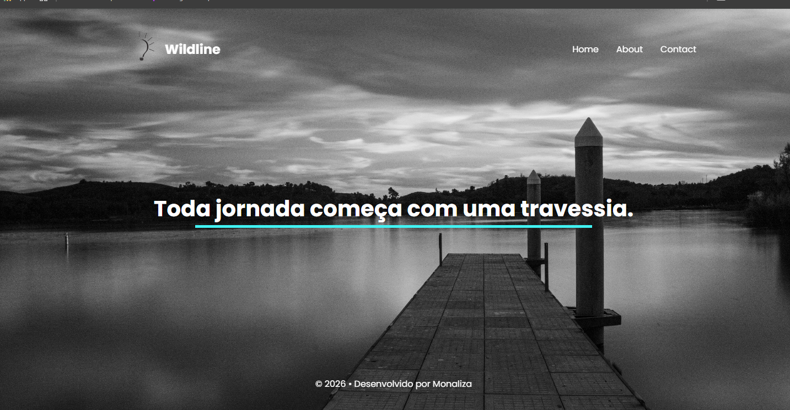
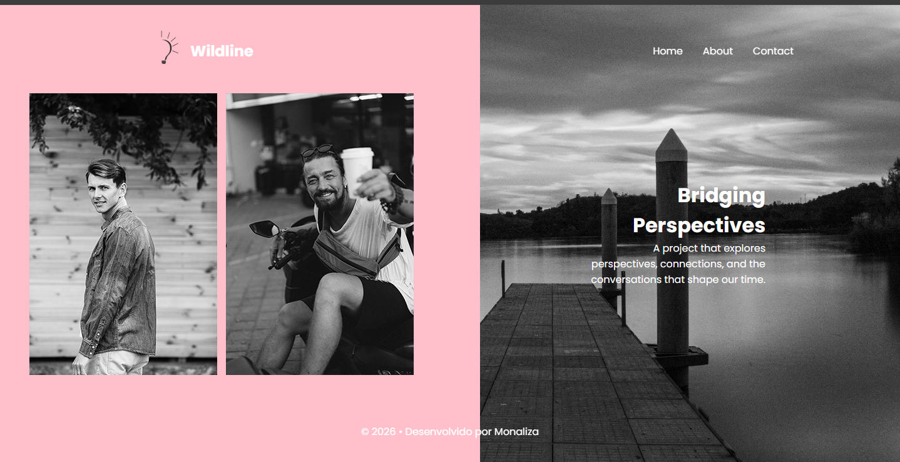
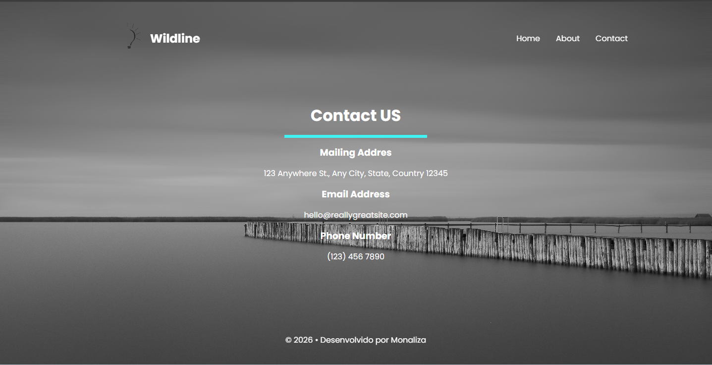

# Atividade React - Rotas

Este projeto foi desenvolvido como atividade prática para estudo de **React Router**, com o objetivo de entender a navegação entre páginas em uma aplicação React.

## 🚀 Tecnologias utilizadas
- React
- React Router DOM
- JavaScript
- CSS
- Vite

## 📂 Estrutura do projeto

```bash
ROTAS-REACT/
├─ node_modules/
├─ public/
├─ src/
│  ├─ assets/
│  ├─ Components/
│  │  ├─ Footer.jsx
│  │  └─ Header.jsx
│  ├─ Layout/
│  │  └─ Layout.jsx
│  ├─ Pages/
│  │  ├─ About.jsx
│  │  ├─ Contact.jsx
│  │  ├─ Home.jsx
│  │  └─ NotFound.jsx
│  ├─ App.css
│  ├─ App.jsx
│  └─ main.jsx
├─ .gitignore
├─ eslint.config.js
├─ index.html
├─ package-lock.json
├─ package.json
├─ README.md
└─ vite.config.js
```

## 📄 Funcionalidades
- Navegação entre páginas sem recarregamento
- Componentes reutilizáveis
- Layout organizado por pastas
- Estilização com CSS
- Estrutura moderna com Vite

## ▶️ Como executar o projeto
1. Clone o repositório:
```bash
git clone https://github.com/seu-usuario/atividade-react-rotas.git
```

2. Acesse a pasta do projeto:
```bash
cd rotas-react
```

3. Instale as dependências:
```bash
npm install
```

4. Execute o projeto:
```bash
npm run dev
```

O projeto estará disponível em:
```bash
http://localhost:5173
```

## 🖼️ Preview
<p align="center">
  
  
  
</p>

📌 Objetivo do projeto

Praticar o uso de rotas no React, organização de componentes e criação de layouts reutilizáveis.

👩‍💻 Autora

Monaliza Vasconcelos
